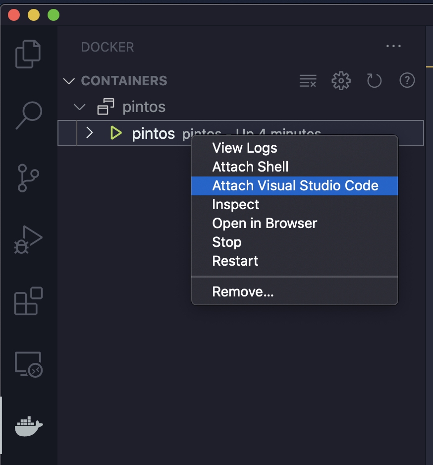
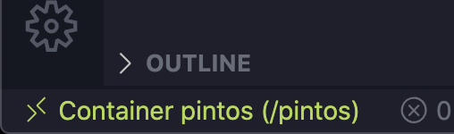

# VSCode Development Setup (by Mustafa Quraish)

## Docker-Compose file

```yaml
version: '3.4'
services:
    dev:
        image: thierrysans/pintos
        container_name: pintos
        volumes:
            - .:/pintos
        working_dir: /pintos
        hostname: pintos
        tty: true
        entrypoint: bash
```
> `docker-compose.yml` file contents

## How to set up working environment:

- Run `docker-compose up -d` to start the Docker container from the directory containing the above docker-compose file:

```bash
$> ls
docker-compose.yml
$> docker-compose up -d
Creating network "pintos_default" with the default driver
Creating pintos ... done
$>
```

- In VSCode, download the following extensions from the marketplace (all are from Microsoft):
    - *Docker*
    - *Remote Development*
    - *Remote - Containers*
- In VSCode, Go to *"Remote Explorer"* tab on left, right click on *`pintos`* in running containers and click *"Attach to container"*. This should open up VSCode inside the container. Verify this by looking at the bottom left of the opened window, it should say `Container pintos`.



> Attaching VSCode to container



> Successfully connected!

- All integrated terminals should now directly open inside the container, and you can even do stuff like `code file.c` from the terminal to open it up in the editor. This is usually not possible if VSCode itself is not hooked into the container.
- I recommend installing the C/C++ extension at least for a good dev experience. You might also find `cscope` useful.

---

## How to debug:

- Attach VSCode to the container, go into your source folder (here I assume the `pintos` root)
- Install the ***Native Debug*** extension (while inside the container)
- In the ***Run*** menu on the top, click ***Add Configuration***. This should open up a `launch.json` file. Modify the values here based on the example below (which is set up to debug using `src/threads/build/kernel.o`):

```json
{
    "version": "0.2.0",
    "configurations": [
        {
            "type": "gdb",
            "request": "attach",
            "name": "Attach to Pintos",
            "executable": "${workspaceFolder}/src/threads/build/kernel.o",
            "target": ":1234",
            "remote": true,
            "cwd": "${workspaceRoot}", 
            "gdbpath": "/pintos/src/utils/pintos-gdb"
        }
    ]
}
```
> `launch.json` file with configuration

- That should be all the configuration you need. In the integrated terminal (which is inside the container), start up pintos pintos with the `--gdb`, so for example:

```bash
pintos --gdb -v -k -T 60 --bochs -- -q run alarm-single
```

- Then, set a breakpoint somewhere, say in `src/threads/init.c` at line 96. To do this, open the file in VSCode, hover your mouse on the left of the line number till you see a red circle show, and then click it to set the breakpoint.


> What setting a breakpoint looks like in VSCode

- Go to the debug panel on the left, and it should say ***Attach to Pintos*** with a green Run button beside it. Press run.


> Start GDB

- Voila! If you did everything right, you should have stopped at the breakpoint, and have the stack / local variables visible to you. You can open the ***Debug Console*** (Should be a tab right next to the integrated ***Terminal***) to get the `gdb` console and run commands manually if you wish to do so (such as `dumplist &all_list thread allelem`)

## Some helpful VSCode keybindings

Here's some of the things you can look for and remember / customize shortcuts for in the `Keyboard Shortcuts` menu (in preferences). On Windows/Linux, replace `Cmd` with `Ctrl`

- *Search for files by name*: Search for and open a file by searching for any part of it's name / the directory it was in. (Default: `Cmd`+ `P`)
- *Go to symbol in file*: Search for a symbol (variable / function name) in the current file. (Default: `Cmd`+`Shift`+`O` )
- *Go to symbol in workspace:* Same as above, but the search is done across your entire workspace. Very useful for large code bases like this! (Default: `Cmd` + `T`)
- *Jump to definition*: Jump to the place where the function under the cursor is defined. Very useful! (Default: `F12`, can also get this in the right-click menu). Also related: *Find all references, Jump to declaration.*
- *Go back/Go forward:* Jump back and forth between cursor positions. Especially useful with the above shortcut so you can jump back to the line you were previously on. (Defaults: `Control`+ `-`/`Control`+`Shift`+ `-` [mac] and `Alt`+ `-`/`Alt`+`Shift`+ `-` [others])