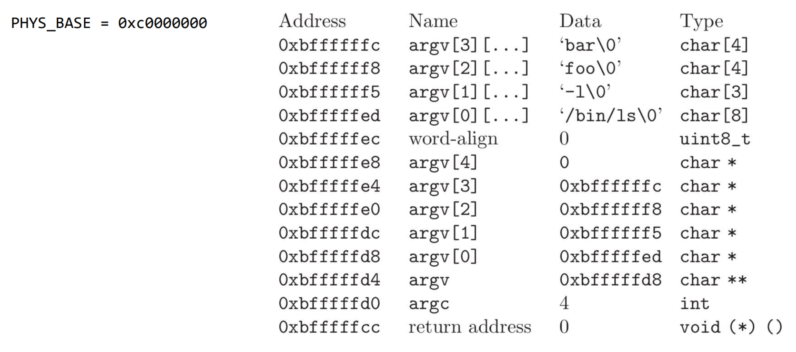

Some key fact about virtual memory:

- All addresses manipulated by assembly instructions are virtual addresses. Assembly instructions never manipulate physical addresses.
- The translation from a virtual address to a physical address is done automatically by the MMU (Memory Management Unit) based on the information mapping stored in the page directory. The page directory can be stored anywhere in memory and its location is stored in the CR3 pointer. 
- The kernel page directory maps the entire memory space so all adresses are valid and accessible. However, the user programs have a sparse page directory mapping and not all adresses are valid because not accessible (not mapped). 
- A page number x in the kernel page directory might corresponds to a different page number in the user program. 

1. Where are the command line arguments stored when they are initially passed into the program?
​
2. When passing command-line arguments to a program, in which order should the arguments be pushed onto the user program stack?
​

3. Which method is responsible for setting up the stack of a user program? In other words, when and where are the pages allocated for the user program?
​
4. What is the (virtual) address of the beginning of the stack when the kernel thread is executing the user's program (user mode)?

5. What is the (virtual) address of the beginning of the stack when the kernel thread is executing the user's program (user mode)? 

6. Where is the page directory store for each process? 

7. In Pintos, which function do you use to translate a "user address" into a "kernel address"? 

8. When a system call is executed and a user address is passed as an argument, how do you know whether this is a valid user address? 

